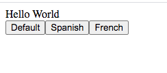
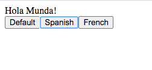
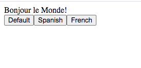

# AngularRedux

## Redux setup

Run `npm install redux @angular-redux/store --save` to install redux.

This is small app to implement redux in angular.  
Having communication between 2 component  
 - Comp-one contain message
 - Comp-two contain button that can change the message

For default button
  
  
For spanish button  
  
  
 For French button  
  